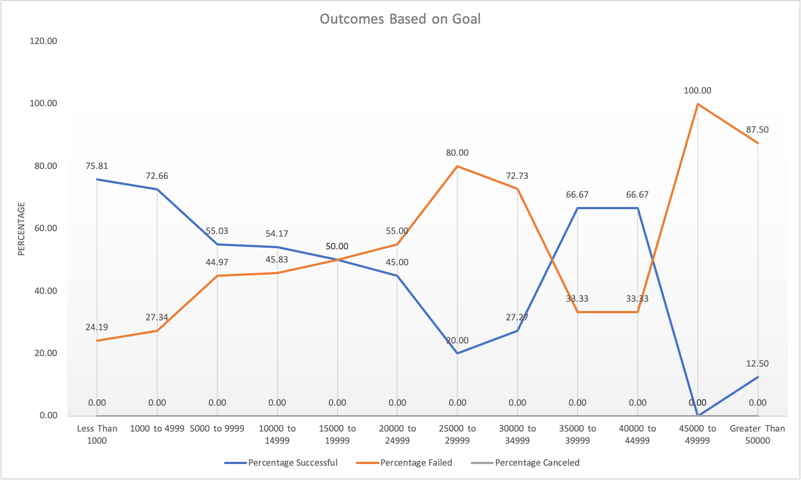
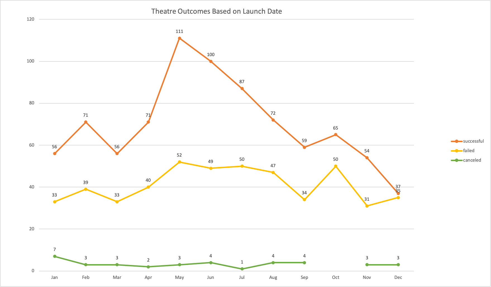

# Module 1 Challenge
### Project Overview
The purpose of this project is to build a detailed analysis of Kickstarter campaigns. 
In order to make data driven decisions when helping Lousie with her own Kickstarter campaign. 
To better understand Kickstarter campaigns, 4,114 kickstarter campaigns will be analyzed. Data points included are name, goal, pledge, outcome, country, category, etc... 
Having this data is very valuable when starting a kickstarter campaign, because it will help Lousie better understand what is an attainable goal and help her choose a launch date that will yield a successful outcome for her campaign.

### Analysis and Challenges
This kickstarter campaign analysis will focus on outcome of the campaign based on the goal and outcome relative to launch date.
There are four different outcomes for kickstarter campaigns. Those outcomes are 'successful', 'failed', 'live', and 'canceled'. 
These outcomes define if the campaign reached its set goal. For example, Lousie set a goal of 4,000 dollars for her play 'Fever' . 
The outcome will be defined by the pledge reaching the goal or not. The pledge is dollar amount she was able to raise for her campaign.
If we continue with the example that Louise has a goal of $4,000 for her kickstarter campaign. 
Lousie's goal is between $1,000 - $4,999 giving her a 72.66 percent chance that she will be successful reaching her goal. 
However, if Louise wants to be more ambitions 

