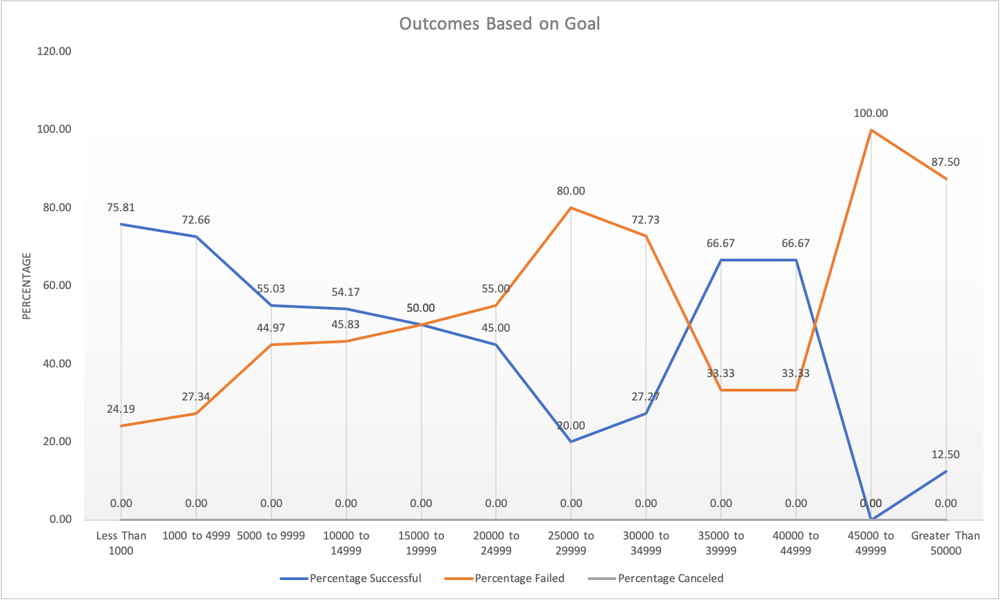
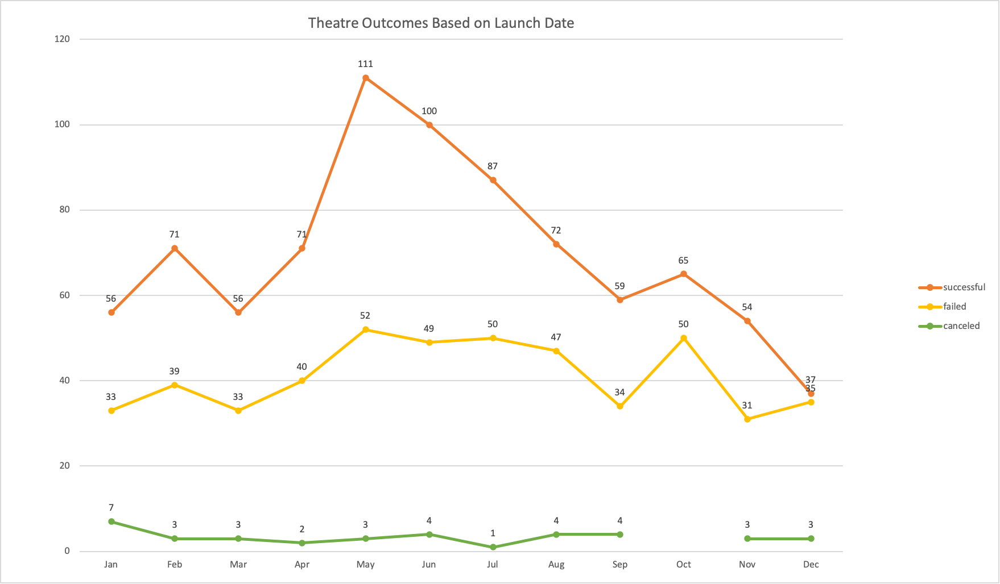

# Module 1 Challenge
### Project Overview
The purpose of this project is to build a detailed analysis of Kickstarter campaigns. 
In order to make data driven decisions when helping Lousie with her own Kickstarter campaign. A kickstarter is a funding platform for creative projects such as, films, games, plays, technology, and art. A kickstarter is an innovative, imaginative, and ambitious way to bring ideas to life through the direct support of others.
To better understand Kickstarter campaigns, 4,114 kickstarter campaigns will be analyzed. Data points included are name, goal, pledge, outcome, country, category, etc... 
Having this data is very valuable when starting a kickstarter campaign, because it will help Lousie better understand what is an attainable goal and help her choose a launch date that will yield a successful outcome for her campaign.

### Analysis and Challenges

#### Analysis
This kickstarter campaign analysis will focus on outcome of the campaign based on the goal and outcome relative to launch date.
There are four different outcomes for kickstarter campaigns. The possible outcomes are 'successful', 'failed', 'live', and 'canceled'. 
These outcomes define if the campaign reached its set goal. For example, Lousie set a goal of $4,000 for her play 'Fever' . 
The outcome will be defined by the pledge reaching the goal. The pledge is dollar amount raised for a specific campaign.
If we continue with the example that Louise has a goal of $4,000 for her kickstarter campaign. 
Lousie's goal is between $1,000 - $4,999 giving her a 72.66 percent chance that she will be successful reaching her goal. Its important to note that Louise's campaign was compared to similar campaigns filtered by subcategory 'plays' and country 'Great Britian'. 

Furthermore, an analysis of outcomes based on launch date was conducted and the results can be seen below. The graph shows that campaigns for plays in Great Britian were most likely to be succesful during the month on May. Louise can use this information to make a data driven decision as to when it is best for her to release her campaign. If Louise launches her campaign during the month of May she is more likely to reach her goal.

#### Note:
The graphs above were created in excel using the Kickstarter_Challenge excel document. Calculations were done within the excel document and pivoting tables were used to manipulate the data to only show similar campaings to Louise's. To validate calculations for the Outcomes Based on Goals graph open the Kickstarter_Challenge.xlsx document and look at the Outcome Based on Goals sheet. In addition, to certify calculations for the Theatre Outcomes based on Launch Date graph open the Outcome Based on Launch Date sheet.

#### Challenges
With the analysis above Lousie can be better prepared to launch her campaign and define a reachable goal. That being said, there is no guarantee that Lousie's campaign will be succesful. There are limitation with the data and there are uncontrolable variables. The data has limitations such range of data and manipulation of data. The data only ranges from 2009 through 2015 which is very limited. The more data there is the more accurate the analysis. Moreover, the possiblity of inacurate data being recorded has to be taken into account. For example, its possible that initially a kickstarter had an aggresive goal to meet. However, as the deadline approaches the kickstarter lowers their goal to match the pledge and doing so it shows that the kickstart was succesful. Finally, uncontrolable variables need to be considered for this analysis, such as COVID19.
